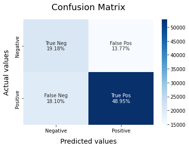

### Sentiment Analysis using a machine learning model

- Dataset is selected from kaggle and is uploaded in the in the `sentiment140` folder.
- Test dataset is also uploaded.
- Main focus was to consider the emotes as well in the dataset. Therefore we have converted the emotes to texts and then applied the preprocessing (i.e. - Lemmetization and Vectorization)
- For the above task, library used is `demoji`.
- Models applied for training - Logistic Regression and Bernoulli Classification model.
- 
