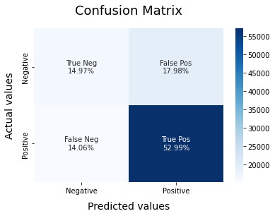

### Sentiment Analysis using a machine learning model

[Dataset](https://www.kaggle.com/datasets/kazanova/sentiment140)

- Main focus was to consider the emotes as well in the dataset. Therefore we have converted the emotes to texts and then applied the preprocessing (i.e. - Lemmetization and Vectorization)
- For the above task, library used is `demoji`.
- Models applied for training - Logistic Regression and Bernoulli Classification model.
   
- Logistic Regression model confusion matrix 
   
- Bernoulli Classification model confusion matrix 
   
- Logistic Regression model is chosen as the final model because it has lower false positive rate.
- False positive rate is chosen because we may bare the reviews which are positive but marked as negative, but we want that the model don't miss the reviews which are negative and are missed by the model.
